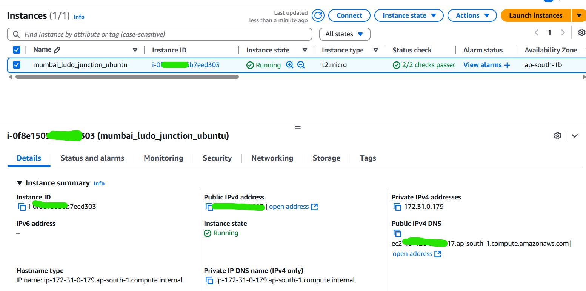
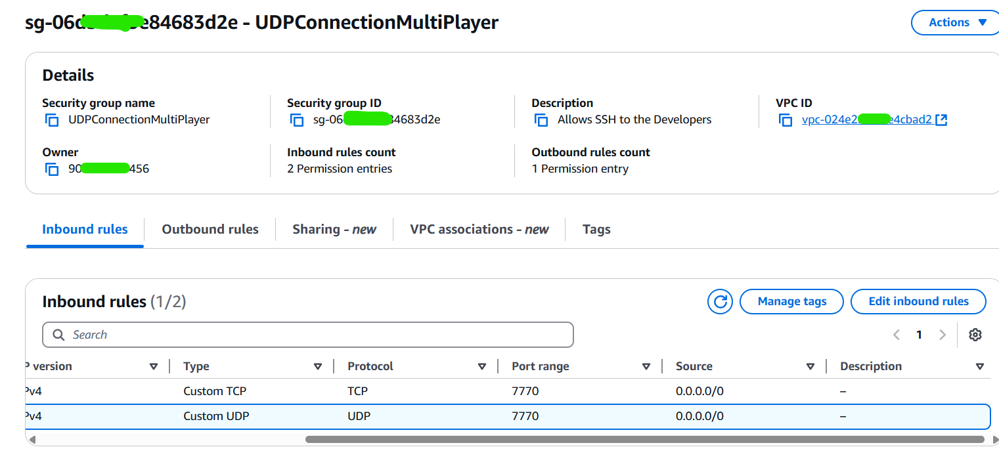

# Ludo Game Server

## Overview
- **Description**: A lightweight Ludo game server built with FishNet and LiteNetLib, supporting multiplayer gameplay over UDP on port 7770.
- **Deployment**: On EC2 instance. Uses a blue-green deployment strategy with Docker for minimal downtime (~2 seconds).

## Cloud Configuration:
⚠️ I've migrated application currently from EC2 to Lightsail due to client's requirement.
Our setup includes:
1. EC2 setup ( launch new instance (ubuntu) , attach elastic IP, configure VPC)
2. Install Docker, Unity build packages, unity compiler tools.
3. Open ports (7770)

 

## Deployment Instructions

### Prerequisites
- Docker installed on the host machine.
- UDP port 7770 open on the host firewall.

### Steps
1. **Clone the Repository**
  
   `git clone <repository-url>` 
   `cd <repository-directory>`

## Build and Deploy: **Blue-Green**

Make sure the LudoServer directory and Dockerfile are in the current directory.
Run the deployment script:
 

`chmod +x Upgrade.sh`
 
`./Upgrade.sh`
 

The script will:
Build a new Docker image (ludo-server-image:<timestamp>).
Deploy the new container on a temporary port (7771 or 7772).
Test the new container (UDP on port 7770).
Switch traffic to the new container on port 7770.
Clean up old images.
Verify Deployment
Check the running container:

`docker ps`
 
Test connectivity from another machine:

`nc -u -v <server-ip> 7770`

Notes
Downtime: ~2 seconds during deployment.